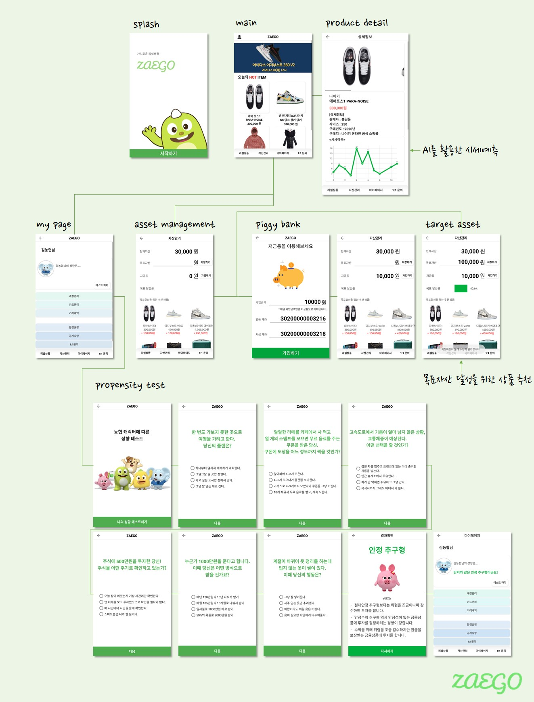

# NHhackathon_Android
가치로운 리셀생활  **ZAEGO**

기획 - [이수민](https://blog.naver.com/dltnals_3360), 전채희 / 개발 - [이정민](https://github.com/Lee-JeongMin), [임예빈](https://github.com/Yeabin-Lim), [전지원](https://github.com/jw070698)

개발 기간 : 2020.12.11 ~ 2020.12.14

### 💡 서비스 소개

------

MZ세대를 중심으로 리셀시장의 규모가 커지고 있다. 리셀을 활용한 재테크가 활성화 하고 있으며, 리셀테크라 일컫는다. 리셀테크란 희소성 있는 제품을 구매해 프리미엄가를 붙여 다시 되팔아 수익을 창출하는 재테크 방법이다. 주로 온라인으로 거래되며 기존 금융상품과 다르게 간단한 방법으로 수익을 창출할 수 있어 디지털에 익숙한 MZ세대는 이에 열광한다.

따라서 우리는 농협 API와 AI를 사용해 리셀 플랫폼과 자산관리 서비스를 합친 ZAEGO를 개발하고자 한다. ZAEGO를 통해 리셀거래를 하고 거래를 통한 수익을 관리할 수 있다. 

### 📱 Workflow

------

### 🎥 시연영상

------

